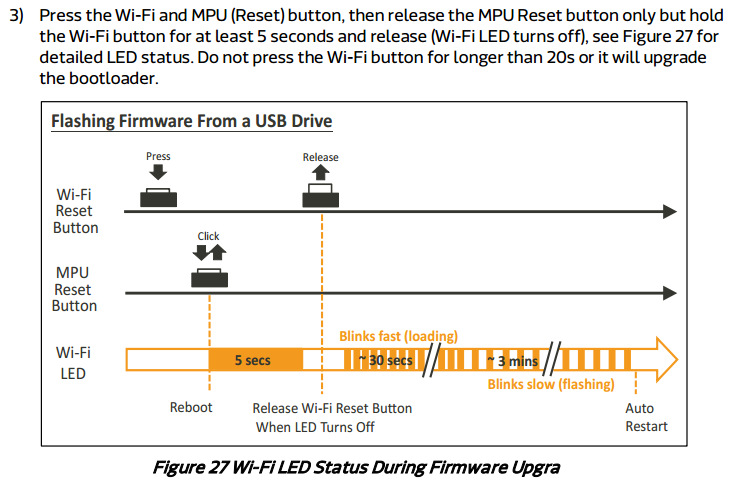

## Introducing
當開發被你玩壞  
當你想還原成新買的樣子   
你可以參考以下作法↓

## Rebuilding Setp
* step1:
準備USB隨身碟，FAT32格式

* step2:  
  下載官網最新的firmware
  https://labs.mediatek.com/site/global/developer_tools/mediatek_linkit_smart_7688/sdt_intro/index.gsp

  download and uzip

* step3: 
  拷貝lks7688.img至隨身碟根目錄

* step4: 
  隨身碟接至7688的USB HOST

* step5: 
  按住wifi reset 不放，再按一下MPU reset並放開(wifi reset還不能放喔)，等五秒後再放開wifi reset

* step6: 
 等約五分鐘…wifi 燈號一開始會快閃，然後穩定的閃亮，更新完成時7688會重啟
 

* step7: 
  done.   
